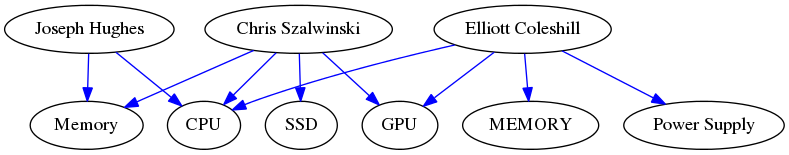
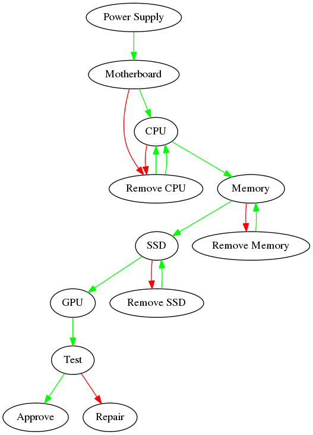

## This project:
- stores the CSV file data in a 2D structure
- creates tasks based on CSV file.
- creates items based on CSV file.
- create orders based on CSV file.
- reads all the data, creates a graph to see a picture of the routing information.

Example output:

